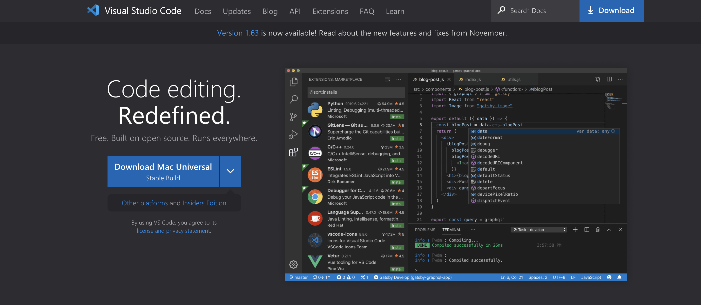
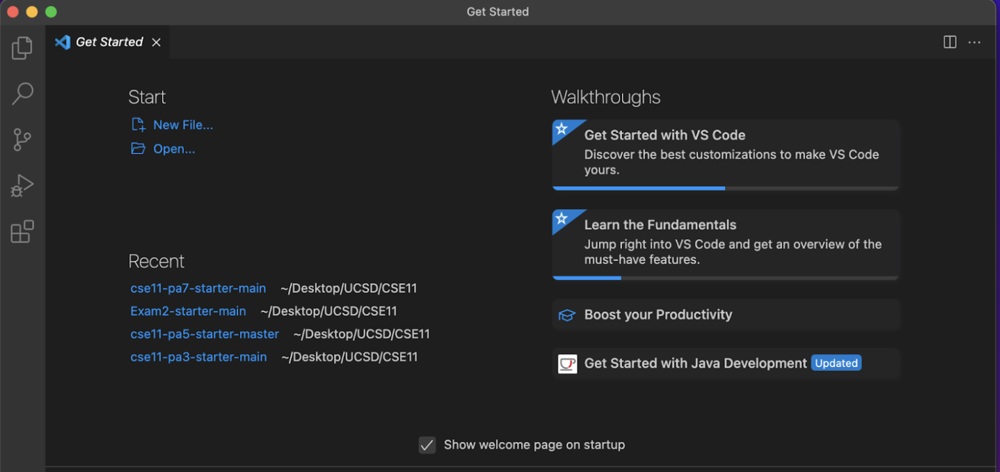
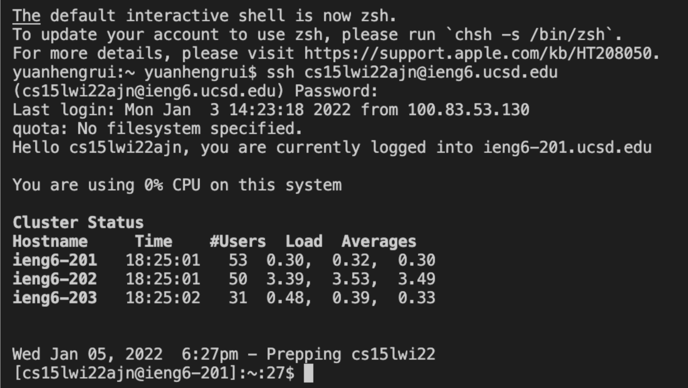
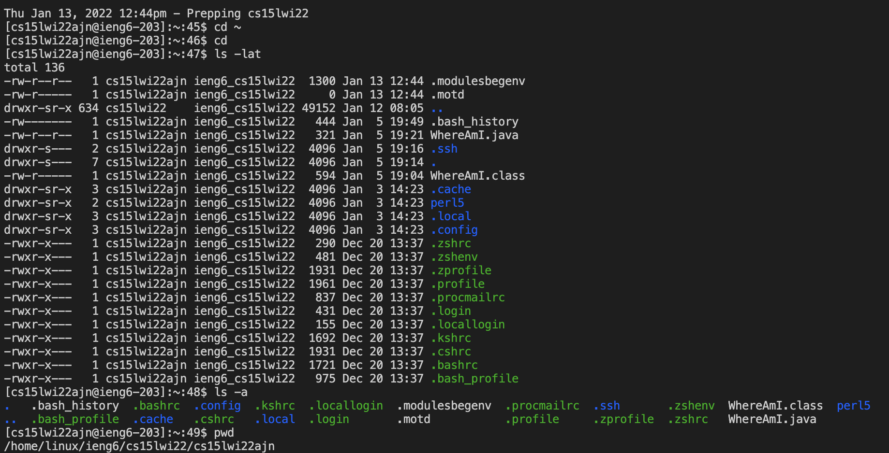
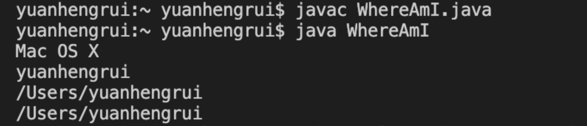
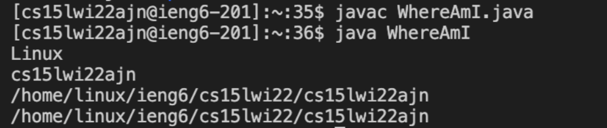
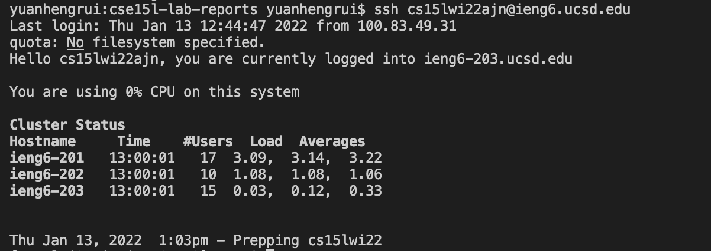
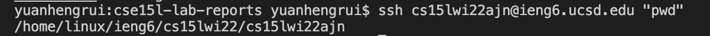

# Tutorial-log into course specific account

## Step 1: Installing VS Code
1. I go to this site [https://code.visualstudio.com/](https://code.visualstudio.com/) and download the VSCode 
 
2. After it is sucessfully downloaded, open it up and I can see:


## Step 2: Remotely Connecting
1. I go to this site [https://sdacs.ucsd.edu/~icc/index.php](https://sdacs.ucsd.edu/~icc/index.php) and find my CSE15L course specific account. I resset the password to activate my account.
2. Open the terminal on VSCode and enter the command `ssh cs15lwi22ajn@ieng6.ucsd.edu` I then be prompted to enter the password (Note: the password will not show up on terminal when I entered it) and logged into my course specific account and connected to the server


## Step 3: Trying Some Commands
1. There are a few commands provided and I tied entering some on my terminal
```
cd ~
cd 
ls -lat 
ls -a
pwd
```
Here is the what the terminal behaved:


## Step 4: Moving Files with `scp`
1. I create a new file called WhereAmI.java with code as following:
```
class WhereAmI {
  public static void main(String[] args) {
    System.out.println(System.getProperty("os.name"));
    System.out.println(System.getProperty("user.name"));
    System.out.println(System.getProperty("user.home"));
    System.out.println(System.getProperty("user.dir"));
  }
}
```
2. I compiled WhereAmI.java and ran it on VSCode through `javac` and  `java` it (Terminal output:
 
3. I copied WhereAmI.java to the remote server through `scp` and logged into my account and `javac` and  `java` it (This time on the server) (Terminal outputs:
 


## Step 5: Setting an SSH Key
In this step, I utilized the `ssh-keygen` program, where two files are created in this process: `id_rsa` to save the private password and `id_rsa.pub` to save the public password. Then I `scp` the public key to the `.ssh` directory on the server. After doing these, I could log into my account on termial without entering password since it has been stored in my course specific account on the server.

## Step 6: Optimizing Remote Running
I tried a few ways to optimize the remote running such as using the upper arrow key on the keyboard to get the past commands or writing commond in quotes at the end of `ssh` log in command to run the commond in quotes on remote server and then exit. 

In this line, I logged on the server and printed the working directory and exit, which basically combine two seprate line of code into one.

Using the upper arrow key to re-run past commands usually only includes two keystrokes "upper arrow"+"enter" compared to typeing the whole command `ssh cs15lwi22ajn@ieng6.ucsd.edu` which needs 32 keystrokes.

Writing command in quotes at the end of `ssh` log in command to run the command in quotes on remote server and then exit can save 3 keystrokes.


