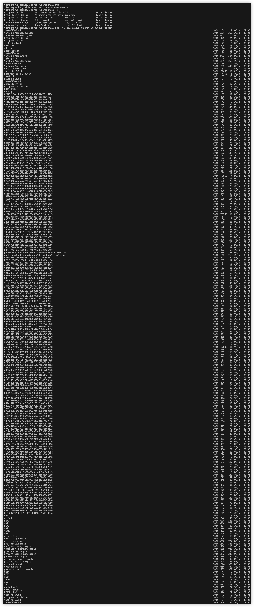
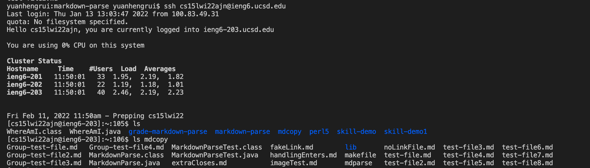
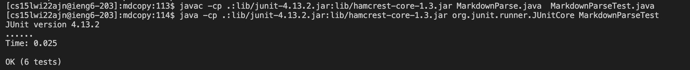
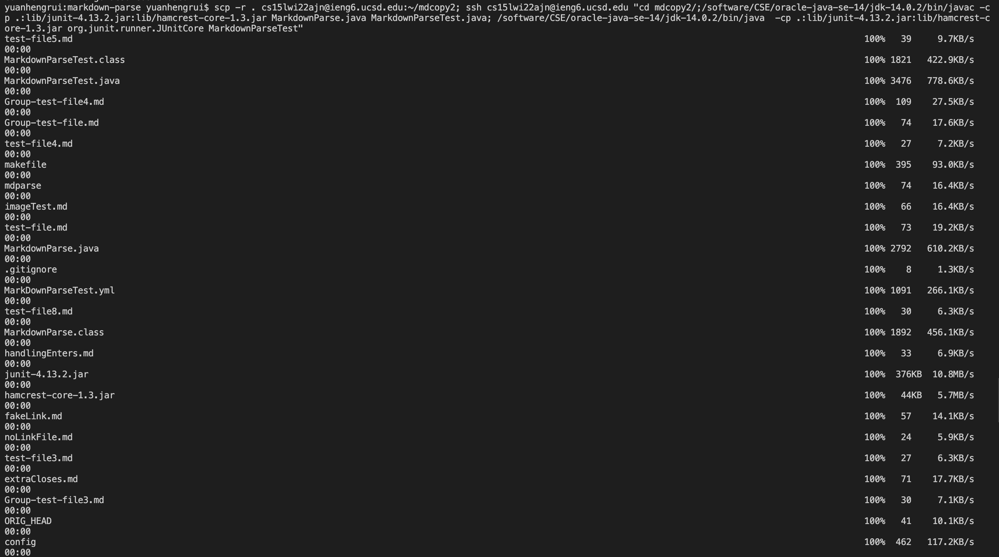
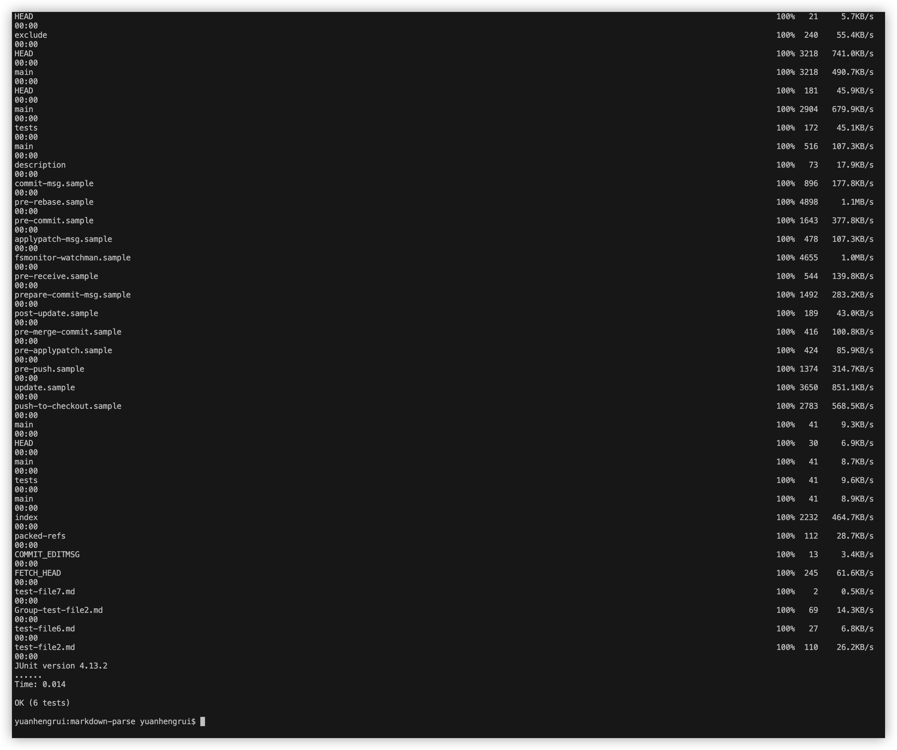

# Week-6-lab-report: Copy Whole Directories with `scp -r`

## 1. Copy whole markdown-parse directory to ieng6 account
First, I check the markdown-parse directory by `pwd` and all files in the directory by `ls`

Then, I use `scp -r . cs15lwi22ajn@ieng6.ucsd.edu:~/mdcopy` command to create mdcopy directory on the server and copy markdown-parse directory recursively to mdcopy

## 2. Log into ieng6 account after copying the directory and compiling and running the tests for your repository
First, I use `ssh cs15lwi22ajn@ieng6.ucsd.edu` command to log into my course-specific account and change the working directory to mdcopy by entering command `cd mdcopy`

Then, I use `javac -cp .:lib/junit-4.13.2.jar:lib/hamcrest-core-1.3.jar MarkdownParse.java MarkdownParseTest.java` and `java -cp .:lib/junit-4.13.2.jar:lib/hamcrest-core-1.3.jar org.junit.runner.JUnitCore MarkdownParseTest` commands to compile and run the Junit test on server. The tests all passed on my server.

## 3. Complete the last two steps in one-line command
In this step, I entered the one-line command `scp -r . cs15lwi22ajn@ieng6.ucsd.edu:~/mdcopy2; ssh cs15lwi22ajn@ieng6.ucsd.edu "cd mdcopy2/;/software/CSE/oracle-java-se-14/jdk-14.0.2/bin/javac -cp .:lib/junit-4.13.2.jar:lib/hamcrest-core-1.3.jar MarkdownParse.java MarkdownParseTest.java; /software/CSE/oracle-java-se-14/jdk-14.0.2/bin/java -cp .:lib/junit-4.13.2.jar:lib/hamcrest-core-1.3.jar org.junit.runner.JUnitCore MarkdownParseTest"` to copy markdown-parse directory recursively to the server and save it in the newly-created directory mdcopy2 and run junit tests on remote server.
The tests run successfully on my server.

