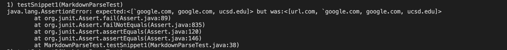
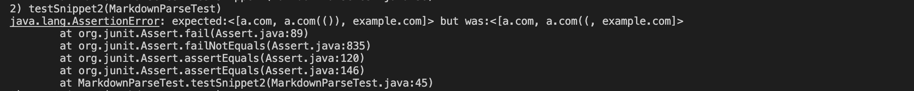
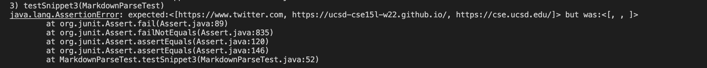

# Week-8-lab-report

[Link to my repository](https://github.com/h4yuan/markdown-parse)

[Link to repository I reviewed](https://github.com/floatboat/markdown-parse)

## Expected output for snippet 1
[`google.com, google.com, ucsd.edu]

## Expected output for snippet 2
[a.com, a.com(()), example.com]

## Expected output for snippet 3
[https://www.twitter.com, https://ucsd-cse15l-w22.github.io/, https://cse.ucsd.edu/]

## Code to change three snippets to tests for my implementation
Snippet1

Snippet2

Snippet3

## Code to change three snippets to tests for implementation reviewed
Snippet1

Snippet1

Snippet3

## Output when running Junit tests for my implementation
Snippet1(test fails)

Snippet2(test fails)

Snippet3(test fails)

## Output when running Junit tests for implementation reviewed
Snippet1(test fails)

Snippet2(test fails)

Snippet3(test fails)

## Questions
1. Do you think there is a small (<10 lines) code change that will make your program work for snippet 1 and all related cases that use inline code with backticks?

Yes. The problem with my code is that my code consider `url.com` as a valid link and print it out but the fact is it's not a valid link in Markdown. Therefore, I only need to add in the while loop a if statement to check whether the backticks happen before the open brackets [. If it is the case, consider it as a invalid link. If the backtick happen inside the () or [], it is considered part of the link or name of the link which should be considered as valid link.

2. Do you think there is a small (<10 lines) code change that will make your program work for snippet 2 and all related cases that nest parentheses, brackets, and escaped brackets?

Yes. The problem with my code for snippet 2 is that it fails include the two close parentheses for `a.com(())` for the second link, which means that my code fails to detect the real close parentheses. Instead, my code returns the link as soon as it detects the close parentheses. I can simply change my code by adding a if statement to check whether there are more `)` after the first `)` and iterate backwards to include the rest `)` before the last `)` as part of the link to be returned.

3. Do you think there is a small (<10 lines) code change that will make your program work for snippet 3 and all related cases that have newlines in brackets and parentheses?

No. I don't think a small code change is sufficient to deal with cases similar to snippet3 that involve newlines in brackets and parentheses. The essential part of my code relies heavily on keeping track of the parentheses and spaces. To deal with cases involving the newLinkes in brackets and parentheses, I may need to deal with the contents in [] and () before I put them in the loop of my current code to determine whether it is a valid link or not. This can't be done with a small code change.