# Week-8-lab-report

[Link to my repository](https://github.com/h4yuan/markdown-parse)

[Link to repository I reviewed](https://github.com/floatboat/markdown-parse)

## Expected output for snippet 1
[`google.com, google.com, ucsd.edu]
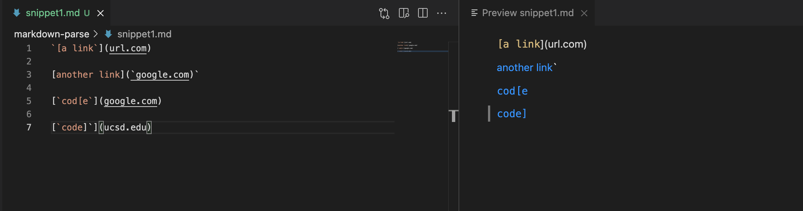

## Expected output for snippet 2
[a.com, a.com(()), example.com]
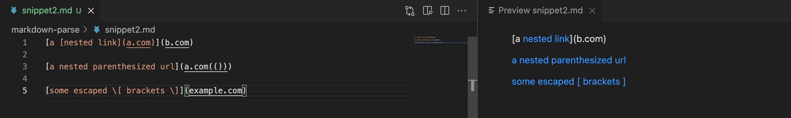

## Expected output for snippet 3
[https://www.twitter.com, https://ucsd-cse15l-w22.github.io/, https://cse.ucsd.edu/]
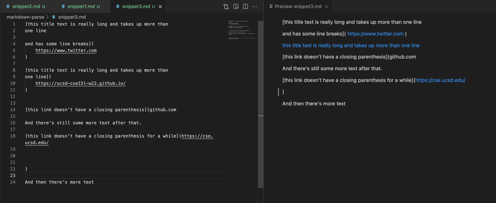

## Code to change three snippets to tests for my implementation
Snippet1
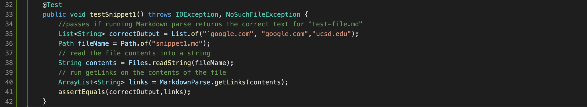

Snippet2
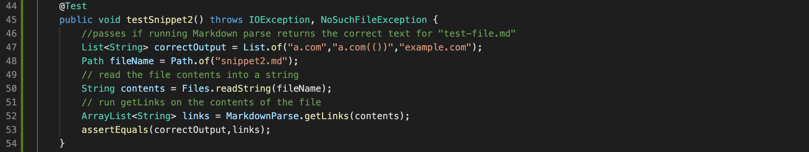

Snippet3
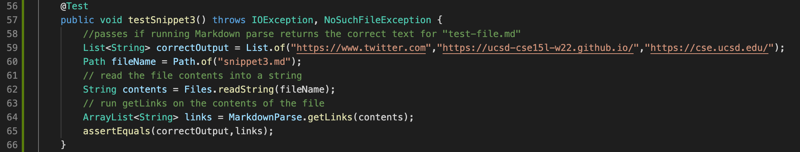

## Code to change three snippets to tests for implementation reviewed
Snippet1
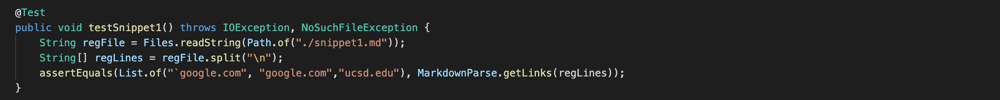

Snippet1
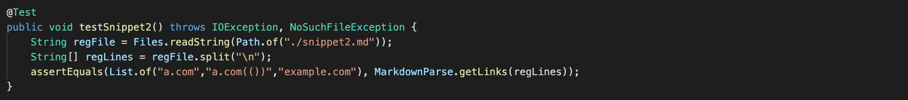

Snippet3
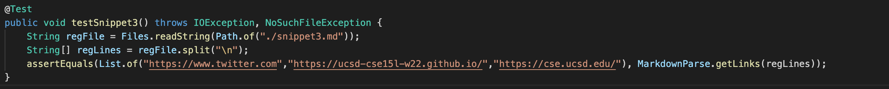

## Output when running Junit tests for my implementation
Snippet1
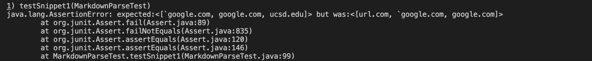

Snippet2

Snippet3
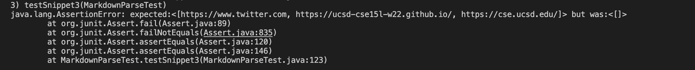