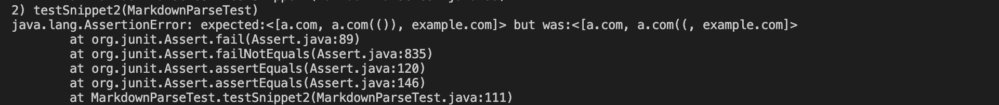

# Week-8-lab-report

[Link to my repository](https://github.com/h4yuan/markdown-parse)

[Link to repository I reviewed](https://github.com/floatboat/markdown-parse)

## Expected output for snippet 1
[`google.com, google.com, ucsd.edu]

## Expected output for snippet 2
[a.com, a.com(()), example.com]

## Expected output for snippet 3
[https://www.twitter.com, https://ucsd-cse15l-w22.github.io/, https://cse.ucsd.edu/]

## Code to change three snippets to tests for my implementation
Snippet1

Snippet2

Snippet3

## Code to change three snippets to tests for implementation reviewed
Snippet1

Snippet1

Snippet3

## Output when running Junit tests for my implementation
Snippet1

Snippet2

Snippet3
