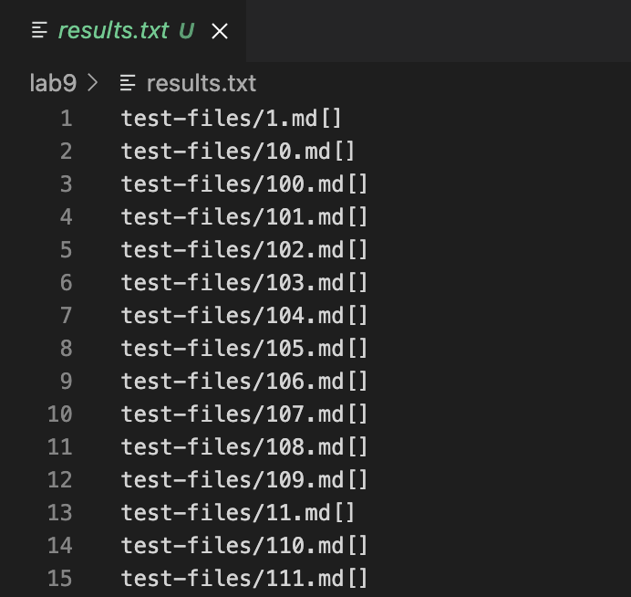
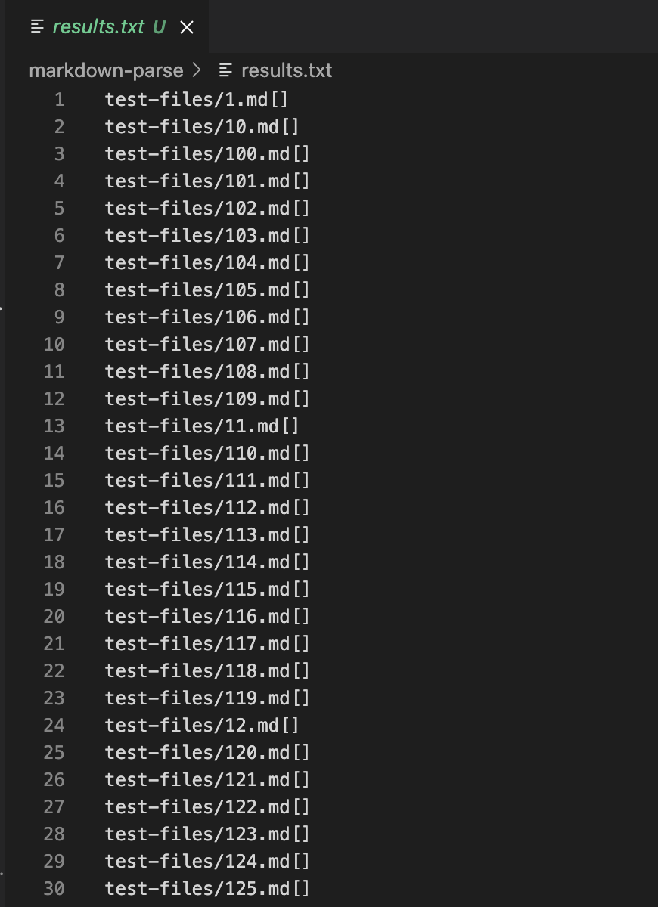
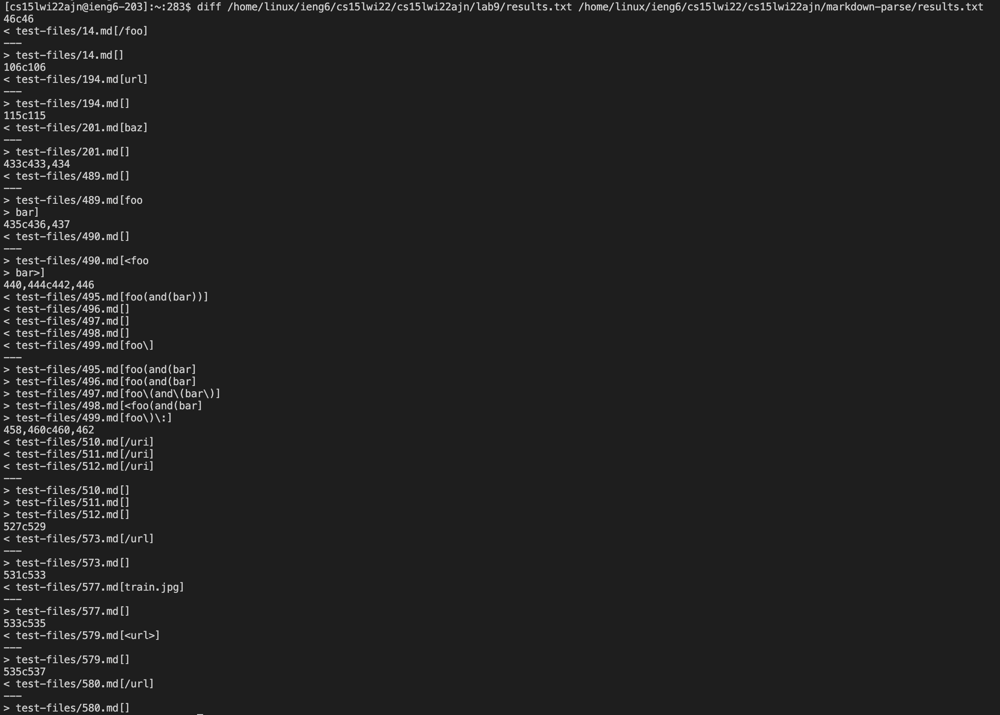
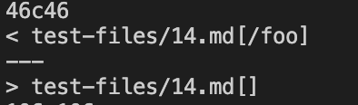
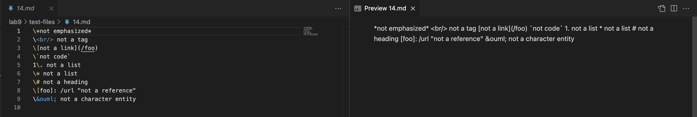
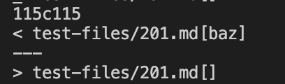
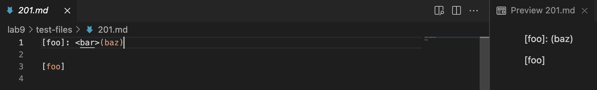

# Week-10-lab-report

1. Edit the `script.sh` such that it will print out the name of the test file before the output

```
for file in test-files/*.md;
do
  echo -n $file
  java MarkdownParse $file
done
```

2. To save the output to a seperate file add `> results.txt` after the `bash script.sh` so that the output of running `bash script.sh`  is redirected to a file `results.txt`.

Part of results.txt shown below


3. Copy `script.sh` to the folder where my implementation of the markdown-parse is stored and do step 2 after `cd` to the correct folder

Part of result.txt shown below


4. To compare the output of two implementations of markdown-parse running tests, run command `diff /home/linux/ieng6/cs15lwi22/cs15lwi22ajn/lab9/results.txt /home/linux/ieng6/cs15lwi22/cs15lwi22ajn/markdown-parse/results.txt`

The terminal output is as follows:


# Analyze two tests whose output are different

## Test 14


According to the preview of 14.md in VS Code, the correct output should be [] since there's no valid link showing up in the preview window

In this case, my implementation is working correctly for this 14.md, but the implementation provided by Joe is incorrect since it's output is [/foo]. The bug in the markdown-parse is that it failed to detect the `\` before the open bracket which makes the it not a valid link. The code that's problematic is the following:
```
while(currentIndex < markdown.length()) {
    int nextOpenBracket = markdown.indexOf("[", currentIndex);
    int nextCodeBlock = markdown.indexOf("\n```");
```

One possible fix to this bug is that before running the while loop, it should first check for the `\` and if it existed before the `[`, don't consider it as a valid link.

## Test 201


According to the preview of 201.md in VSCode, the correct output should be [] since there's no valid link showing up in the preview window

In this case, my implementation is correct but the implementation of markdonw-parse provided by the Joe is wrong since its output of runnning 201.md is [baz] but it should be empty []; Basically, the codes between the close bracket `]` and the open parenthesis `(` (`: <bar>`) made `[foo]: <bar>(baz)` not a valid link. By the codes as follows, in the implementation provided by Joe will directly looks for the open parenthesis `(` and ignore whatever it is in the middle of `]` and `(`. 

```
int nextCloseBracket = markdown.indexOf("]", nextOpenBracket);
int openParen = markdown.indexOf("(", nextCloseBracket);
```

One potential fix to this bug is that between this two line of code, I can loop through the element between `]` and `(` and add a if statement to check whether there is `<some content>`. If there is one, don't consider it as a valid link.